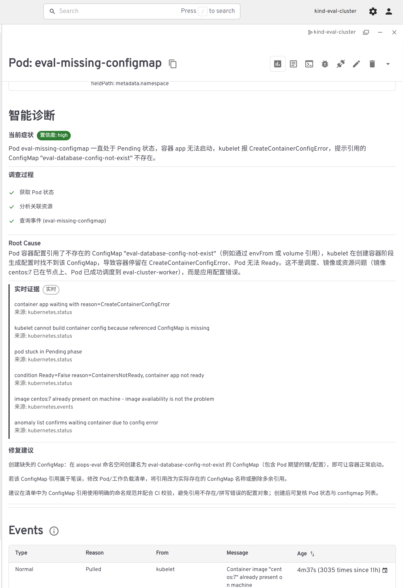
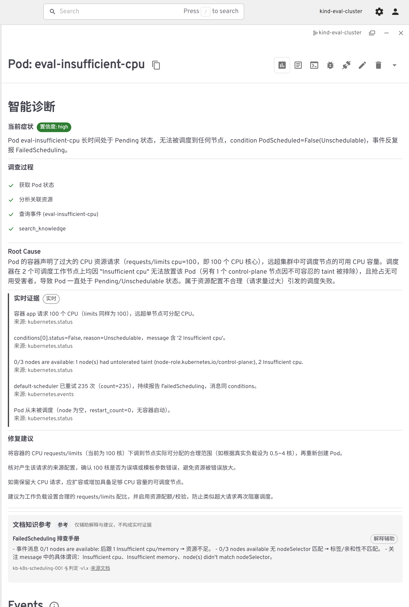
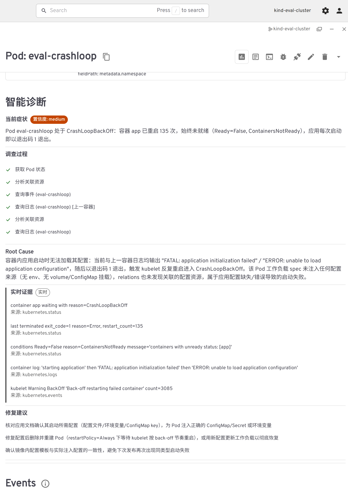
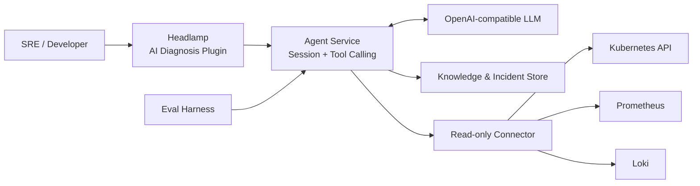

# k8sPilot

> 在 Headlamp 资源详情页内，用可追溯的实时证据完成 Kubernetes 故障诊断与根因定位。


[诊断效果](#诊断效果) · [核心能力](#核心能力) · [工作方式](#工作方式) · [快速开始](#快速开始) · [Agent 评测](#可重复的-agent-评测) · [路线图](#路线图) · [项目文档](#项目文档)

k8sPilot 是一个面向单集群 Kubernetes 的 **Headlamp 智能诊断插件**。运维人员可以直接在 Pod、Deployment、Node 或 PVC 详情页点击「智能诊断」，由 LLM Agent 按需查询资源状态、关联关系、Events、日志与指标，最终返回结构化的症状、调查过程、Root Cause、Evidence、置信度和修复建议。

它不是一个只会解释报错的聊天机器人：**Connector 负责获取事实，Agent 负责形成并验证假设，Eval Harness 负责证明诊断能力是否真的提升。**

## 诊断效果

在 Headlamp 资源详情页中直接查看调查过程、Root Cause、实时证据、知识参考和修复建议。点击图片可查看完整诊断结果。

| ConfigMap 缺失 | CPU 请求过高 | CrashLoopBackOff |
|:---:|:---:|:---:|
| [](docs/images/pod-missing-configmap-diagnosis.png) | [](docs/images/pod-insufficient-cpu-diagnosis.png) | [](docs/images/pod-crashloop-diagnosis.png) |

## 核心能力

- **Headlamp 原生入口**：无需切换到独立控制台，在资源详情页发起诊断并查看结果。
- **Agentic 故障调查**：Agent 根据已获得的证据动态选择 `inspect`、`relations`、`events`、`logs`、`query_metrics` 和 `query_logs`，而不是一次性抓取全部集群数据。
- **多源实时证据**：融合 Kubernetes API、Pod Logs、Prometheus 指标和 Loki 日志；外部数据源不可用时自动降级到 Kubernetes-only 路径。
- **知识与经验增强**：检索 Runbook、已知问题和已验证的历史 Incident，辅助形成假设和选择调查路径。
- **可解释诊断结果**：Root Cause 必须由实时 Evidence 支撑；证据不足时明确返回缺失证据，不编造唯一结论。
- **可重复能力评测**：通过故障注入、Trace、自动评分、冻结基线和候选版本对照，量化准确率、证据质量、成本与延迟。
- **最小权限边界**：Agent 不持有 kubeconfig；集群访问集中在使用只读 ServiceAccount 的 Connector 中。

## 工作方式



一次诊断遵循以下链路：

```text
Headlamp 中点击「智能诊断」
  → 创建 Diagnosis Session
  → Agent 形成初始假设
  → 按需调用 Connector 获取实时事实
  → 用新证据验证、修正或放弃假设
  → 必要时检索历史 Incident / Runbook
  → 输出 Root Cause、Evidence、Confidence 与 Recommendations
```

系统使用固定的信息优先级：

```text
实时 Tool Evidence > 环境配置事实 > 已验证历史 Incident > 文档知识 > 模型自身知识
```

RAG 和历史案例只能辅助调查，不能替代当前集群中的实时证据。

## 组件

| 目录 | 组件 | 技术栈 | 职责 |
|---|---|---|---|
| `headlamp-plugin/ai-diagnosis-plugin/` | Headlamp 插件 | TypeScript / React | 诊断入口、进度轮询与结构化结果展示 |
| `agent-service/` | Agent Service | Python / FastAPI | Diagnosis API、Agent Loop、Session、Trace、历史与知识检索 |
| `connector/` | ai-agent-connector | Go | 使用只读 RBAC 查询 Kubernetes、Prometheus 与 Loki |
| `eval/` | Eval Harness | Python | Case、故障注入、Runner、Scorer、Reporter 与版本对照 |
| `observability/` | 可选数据源 | Prometheus / Loki / Fluent Bit | 提供指标和历史日志证据 |

## 快速开始

下面以 **kind + Windows PowerShell 7** 为例，先跑通 Kubernetes-only 诊断闭环。Prometheus、Loki 和知识库均为可选增强能力。

### 前置条件

- 一个可访问的 Kubernetes 集群，以及可用的 `kubectl`
- Docker；使用 kind 时还需要 `kind`
- Python 3.11+
- Node.js 与 npm
- 一个支持 Function Calling 的 OpenAI-compatible LLM 接口

### 1. 构建并部署只读 Connector

```powershell
docker build -t ai-agent-connector:phase3 ./connector
kind load docker-image ai-agent-connector:phase3 --name <cluster-name>
kubectl apply -f connector/deploy/connector-all.yaml
kubectl -n k8spilot rollout status deployment/ai-agent-connector
```

将 Connector 转发到本机：

```powershell
kubectl -n k8spilot port-forward service/ai-agent-connector 8080:8080
```

### 2. 配置并启动 Agent Service

Agent Service 只读取自身目录下的 `.env`。复制模板后填写配置；`.env` 已被 `.gitignore` 排除，不要提交 API Key。

```powershell
cd agent-service
Copy-Item .env.template .env
```

```dotenv
LLM_BASE_URL=https://api.openai.com/v1
LLM_API_KEY=<your-api-key>
LLM_MODEL=<model-with-function-calling>
CONNECTOR_BASE_URL=http://localhost:8080
```

在该目录安装依赖并启动：

```powershell
python -m venv .venv
.\.venv\Scripts\python -m pip install -e ".[dev]"
.\start-agent.ps1
```

确认服务可用：

```powershell
Invoke-RestMethod http://localhost:8000/healthz
```

### 3. 构建并安装 Headlamp 插件

```powershell
cd headlamp-plugin/ai-diagnosis-plugin
npm install
npm run build

$pluginDir = Join-Path $env:APPDATA 'Headlamp\Config\plugins\ai-diagnosis-plugin'
New-Item -ItemType Directory -Force -Path $pluginDir | Out-Null
Copy-Item -Path '.\dist\*' -Destination $pluginDir -Recurse -Force
```

确认 `%APPDATA%\Headlamp\Config\plugins\ai-diagnosis-plugin\main.js` 已生成，然后重启 Headlamp。进入 Pod、Deployment、Node 或 PVC 详情页，点击「智能诊断」。插件是由 Headlamp 直接加载的前端构建产物，不需要单独运行插件服务；Agent Service 仍需保持运行。

只有开发插件、需要监听源码变化和热加载时才执行：

```powershell
npm start
```

完整的故障注入与端到端验收步骤见 [Phase 1 E2E 文档](docs/phase1-e2e.md)。

### 4. 启用指标与日志增强（可选）

```powershell
kubectl apply -f observability/observability-all.yaml
kubectl -n observability get pods
```

Connector 会通过 `/capabilities` 暴露可用数据源。Prometheus 或 Loki 不可用时，诊断仍会继续，并在结果中记录降级原因。详细部署与验收方式见 [Phase 3 部署文档](docs/phase3-deploy.md)。

### 5. 导入并启用知识库（可选）

Phase 4 使用本地 SQLite FTS5 保存 Runbook、Known Issue 和人工验证过的 Incident。当前支持复用由 k8sPilot 生成的兼容 `knowledge.db`，或先把已有资料映射为 `KnowledgeDocument` / `IncidentCase` 种子数据，再执行内置摄取命令：

```powershell
cd agent-service
$knowledgeDb = Join-Path (Resolve-Path ..) 'data\knowledge.db'
.\.venv\Scripts\python -m app.knowledge.ingest --db $knowledgeDb --show
```

随后在 `agent-service/.env` 中设置知识库的绝对路径并重启 Agent Service：

```dotenv
KNOWLEDGE_DB=D:\AI\k8sPilot\data\knowledge.db
```

当前 CLI 不会直接扫描任意 Markdown 目录，也不接受 JSON、YAML、网页或第三方数据库。已有资料的字段映射、种子示例、重复导入规则和验收步骤见 [知识增强文档](docs/phase4-knowledge.md#导入已有知识库)。

## 可重复的 Agent 评测

k8sPilot 把评测作为产品能力的一部分，而不是只依赖人工观察几次输出。

```text
Versioned Cases
  → Fault Injector
  → Diagnosis Runner
  → Trace Collector
  → Scorer
  → Report / Baseline Comparison
```

当前 Phase 2 冻结基线包含 12 个故障 Case、每个 Case 运行 5 次，覆盖 OOMKilled、ImagePullBackOff、FailedScheduling、CrashLoop、ConfigError、PVC 挂载失败、健康状态与主动弃答场景：

| 指标 | 基线结果 |
|---|---:|
| Root Cause Accuracy | 63.3% |
| Schema Valid Rate | 100% |
| 有效运行 | 12 Cases × 5 Runs |

运行评测：

```powershell
python -m eval run --suite phase1 --runs 5 --profile candidate --trace-dir ./eval-trace
```

对比基线与候选版本：

```powershell
python -m eval compare --baseline <baseline-run> --candidate <candidate-run> --reports-dir reports
```

评测同时记录 Root Cause Accuracy、Wrong Root Cause Rate、Abstention Accuracy、Evidence Recall、Tool Calls、Token Usage 和 Diagnosis Duration。完整说明见 [Phase 2 评测文档](docs/phase2-eval.md)。

## 路线图

每个 Phase 都保持可独立运行，后续能力只增强已有诊断路径，不取代 Kubernetes-only 基线。

| Phase | 能力 | 状态 |
|---|---|---|
| Phase 1 | Headlamp 单集群人工诊断 | ✅ 已完成 |
| Phase 2 | Agent 评测、基线与回归闭环 | ✅ 已完成 |
| Phase 3 | Prometheus/Loki、持久化历史、多资源入口 | ✅ 已实现 |
| Phase 4 | Runbook RAG 与历史 Incident 检索 | 🟡 已实现，测试中 |
| Phase 5 | Alertmanager 告警自动诊断 | 🗺️ 规划中 |
| Phase 6 | 只读修复计划与人工审批 | 🗺️ 规划中 |
| Phase 7 | Policy + Executor 受控执行与审计 | 🗺️ 规划中 |

## 安全与设计边界

- Connector 使用独立 ServiceAccount 和只读 RBAC，不保存 LLM API Key。
- Agent 不直接访问 Kubernetes API，也不持有 kubeconfig。
- 当前主路径只诊断并生成建议，不直接修改集群资源。
- 发送给外部 LLM 的内容可能包含资源名称、标签、Events 和日志片段；请根据环境要求选择模型端点并做好数据治理。
- 当前知识库面向单用户开发环境，多用户 ACL 隔离尚未实现，不应直接作为生产级权限边界。
- 自动修复只有在独立 Executor、策略校验、人工审批、幂等和审计链路完整后才会开放。

## 开发与验证

```powershell
# Connector
cd connector
go test ./...

# Agent Service
cd ../agent-service
.\.venv\Scripts\python -m pytest -q

# Eval Harness（在项目根目录执行）
cd ..
python -m pytest eval/tests -q

# Headlamp 插件
cd headlamp-plugin/ai-diagnosis-plugin
npx tsc --noEmit
npx eslint --cache -c package.json --max-warnings 0 --ext .js,.ts,.tsx src/
npm run build
```

## 项目文档

| 文档 | 内容 |
|---|---|
| [Phase 1 E2E](docs/phase1-e2e.md) | 部署、故障注入和 Headlamp 端到端验收 |
| [Phase 2 Eval](docs/phase2-eval.md) | Case、Runner、评分、基线与候选版本对照 |
| [Phase 3 Deploy](docs/phase3-deploy.md) | Prometheus、Loki、持久化历史与降级验证 |
| [Phase 4 Knowledge](docs/phase4-knowledge.md) | 知识摄取、历史 Incident、引用约束与消融实验 |

## 致谢

k8sPilot 构建于 [Headlamp](https://github.com/kubernetes-sigs/headlamp) 的插件能力之上，并使用 Kubernetes、Prometheus、Loki 与 Fluent Bit 提供实时诊断事实。
