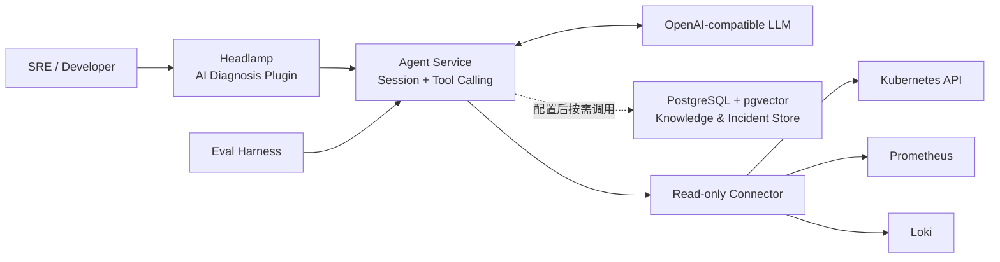

# k8sPilot

> 在 Headlamp 资源详情页内，用可追溯的实时证据完成 Kubernetes 故障诊断与根因定位。


[诊断效果](#诊断效果) · [核心能力](#核心能力) · [工作方式](#工作方式) · [快速开始](#快速开始) · [Agent 评测](#可重复的-agent-评测) · [模型对比](#模型对比2026-09-23) · [路线图](#路线图) · [项目文档](#项目文档)

k8sPilot 是一个面向单集群 Kubernetes 的 **Headlamp 智能诊断插件**。运维人员可在 Pod、Deployment、Node 或 PVC 详情页发起诊断；Agent 按需调查集群事实，返回根因、证据、置信度和建议。

它不是一个只会解释报错的聊天机器人：**Connector 负责获取事实，Agent 负责形成并验证假设，Eval Harness 负责证明诊断能力是否真的提升。**

## 诊断效果

在 Headlamp 资源详情页中直接查看调查过程、Root Cause、实时证据、知识参考和修复建议。点击图片可查看完整诊断结果。

| ConfigMap 缺失 | CPU 请求过高 | CrashLoopBackOff |
|:---:|:---:|:---:|
| [](docs/images/pod-missing-configmap-diagnosis.png) | [](docs/images/pod-insufficient-cpu-diagnosis.png) | [](docs/images/pod-crashloop-diagnosis.png) |

### 演示
<p align="left">
  
</p>

## 核心能力

- **Headlamp 原生入口**：无需切换到独立控制台，在资源详情页发起诊断并查看结果。
- **Agentic 故障调查**：Agent 根据已获得的证据动态选择 `inspect`、`relations`、`events`、`logs`、`query_metrics` 和 `query_logs`，而不是一次性抓取全部集群数据。
- **多源实时证据**：查询 Kubernetes 状态、关系、Events 和 Pod Logs；Prometheus 指标已验证可用。Loki 查询仍有已知问题，数据源不可用时诊断会记录降级原因。
- **知识与经验检索**：可导入 Markdown 运维手册、文本型 PDF 用户指南和已审核 Incident；本地 Embedding 配合 PostgreSQL/pgvector 与词项检索，实时集群证据仍优先。
- **可解释诊断结果**：Root Cause 必须由实时 Evidence 支撑；证据不足时明确返回缺失证据，不编造唯一结论。
- **可重复能力评测**：通过故障注入、Trace、自动评分、冻结基线和候选版本对照，量化准确率、证据质量、成本与延迟。
- **最小权限边界**：Agent 不持有 kubeconfig；集群访问集中在使用只读 ServiceAccount 的 Connector 中。

## 工作方式



一次诊断遵循以下链路：

```text
Headlamp 中点击「智能诊断」
  → 创建 Diagnosis Session
  → Agent 形成初始假设
  → 按需调用 Connector 获取实时事实
  → 用新证据验证、修正或放弃假设
  → 知识库配置后，Agent 可按需检索历史 Incident / Runbook / 用户指南
  → 输出 Root Cause、Evidence、Confidence 与 Recommendations
```

系统使用固定的信息优先级：

```text
实时 Tool Evidence > 环境配置事实 > 已验证历史 Incident > 文档知识 > 模型自身知识
```

RAG 和历史案例只能辅助调查，不能替代当前集群中的实时证据。

## 组件

| 目录 | 组件 | 技术栈 | 职责 |
|---|---|---|---|
| `headlamp-plugin/ai-diagnosis-plugin/` | Headlamp 插件 | TypeScript / React | 诊断入口、进度轮询与结构化结果展示 |
| `agent-service/` | Agent Service | Python / FastAPI | Diagnosis API、Agent Loop、Session、Trace、历史与知识检索 |
| `connector/` | ai-agent-connector | Go | 使用只读 RBAC 查询 Kubernetes、Prometheus 与 Loki |
| `eval/` | Eval Harness | Python | Case、故障注入、Runner、Scorer、Reporter 与版本对照 |
| `observability/` | 可选数据源 | Prometheus / Loki / Fluent Bit | 提供指标和历史日志证据 |

## 快速开始

下面以 **kind + Windows PowerShell 7** 为例运行本地 Agent、集群内只读 Connector 和 Headlamp 插件。

每个编号步骤都从仓库根目录开始；Connector 的 `port-forward` 和 Agent Service 会占用终端，请分别保持运行，后续步骤另开终端执行。

### 前置条件

- Docker、`kubectl` 和 kind
- Python 3.11+
- Node.js 与 npm
- 一个支持 Function Calling 的 OpenAI-compatible LLM 接口

### 1. 创建集群并部署只读 Connector

```powershell
# 如尚无 kind 集群，先创建；已有同名集群时跳过
kind create cluster --name k8spilot
docker build -t connector:phase5 ./connector
kind load docker-image connector:phase5 --name k8spilot
kubectl apply -f connector/deploy/connector-all.yaml
kubectl -n k8spilot rollout status deployment/ai-agent-connector
```

将 Connector 转发到本机：

```powershell
kubectl -n k8spilot port-forward service/ai-agent-connector 8080:8080
```

### 2. 配置并启动 Agent Service

Agent Service 只读取自身目录下的 `.env`。复制模板并填写有效的 LLM 地址、模型和 API Key；不要提交 `.env`。

```powershell
cd agent-service
Copy-Item .env.template .env
notepad .env
```

```dotenv
LLM_BASE_URL=https://api.openai.com/v1
LLM_API_KEY=<your-api-key>
LLM_MODEL=<model-with-function-calling>
CONNECTOR_BASE_URL=http://localhost:8080
```

在该目录安装依赖并启动：

```powershell
python -m venv .venv
.\.venv\Scripts\python -m pip install -e ".[dev]"
.\start-agent.ps1
```

确认服务可用：

```powershell
Invoke-RestMethod http://localhost:8001/healthz
```

### 3. 构建并安装 Headlamp 插件

```powershell
# 在仓库根目录运行
cd headlamp-plugin/ai-diagnosis-plugin
npm install
npm run build

$pluginDir = Join-Path $env:APPDATA 'Headlamp\Config\plugins\ai-diagnosis-plugin'
New-Item -ItemType Directory -Force -Path $pluginDir | Out-Null
Copy-Item -Path '.\dist\*' -Destination $pluginDir -Recurse -Force
```

确认 `%APPDATA%\Headlamp\Config\plugins\ai-diagnosis-plugin\main.js` 已生成，然后重启 Headlamp。进入 Pod、Deployment、Node 或 PVC 详情页，点击「智能诊断」。插件是 Headlamp 直接加载的前端构建产物，不需要单独运行插件服务；Agent Service 仍需保持运行。若要使用告警自动诊断，先把 `connector-all.yaml` 中的 `AGENT_URL` 改为 Connector Pod 可访问的 Agent 地址。

只有开发插件、需要监听源码变化和热加载时才执行：

```powershell
npm start
```

完整的故障注入与端到端验收步骤见 [Phase 1 E2E 文档](docs/phase1-e2e.md)。

### 4. 启用指标与日志增强（可选）

```powershell
kubectl apply -f observability/observability-all.yaml
kubectl -n observability get pods
```

Connector 会通过 `/capabilities` 暴露可用数据源。Prometheus 或 Loki 不可用时，诊断仍会继续，并在结果中记录降级原因。详细部署与验收方式见 [Phase 3 部署文档](docs/phase3-deploy.md)。

### 知识库（可选）

配置 `KNOWLEDGE_DATABASE_URL` 后，Agent 默认会把 `search_knowledge` 和 `search_incidents` 作为可用工具，是否调用由每次诊断按需决定；请求可显式关闭知识检索。文本经本地 Embedding 后写入 PostgreSQL/pgvector，文档片段使用向量与词项 RRF 检索，历史 Incident 仅做词项检索且只有 `verified` 记录可返回。旧 `KNOWLEDGE_DB` SQLite seeds 路径仍保留，但文件导入使用 PostgreSQL，不会自动迁移旧库。

```powershell
# 从仓库根目录执行；首次启用前先按知识库指南准备 PostgreSQL 与 .env
cd agent-service
if (-not (Test-Path .venv\Scripts\python.exe)) { python -m venv .venv }
.\.venv\Scripts\python.exe -m pip install -e ".[knowledge]"
.\.venv\Scripts\python.exe -m app.knowledge.ingest --import ..\docs\knowledge-examples
```

导入支持带 YAML frontmatter 的 `.md`、带同名 `.metadata.yaml` sidecar 的文本型 `.pdf`，以及以 Markdown 表示的 Incident。示例目录只含演示资料，不包含组织内部的真实知识。PDF 扫描件不做 OCR；知识片段会进入现有诊断提示并可能发给配置的外部 LLM。数据库、模型缓存和安全边界、增量导入与删除方法见[知识库与检索指南](docs/knowledge-retrieval.md)。

## 可重复的 Agent 评测

k8sPilot 把评测作为产品能力的一部分，而不是只依赖人工观察几次输出。

```text
Versioned Cases
  → Fault Injector
  → Diagnosis Runner
  → Trace Collector
  → Scorer
  → Report / Baseline Comparison
```

当前原因级评测使用版本化 `cause-level-v1` Case 与 scorer v5。评测会在目标集群注入并清理测试资源；请先确认 `kubectl` 指向专用测试集群，且 Agent 的 `TRACE_DIR` 与 Runner 使用同一路径。

先在一个终端启动 Agent（从仓库根目录执行；另一个终端运行评测）：

```powershell
$traceDir = Join-Path (Resolve-Path .) 'eval-trace'
cd agent-service
.\start-agent.ps1 -TraceDir $traceDir
```

再从仓库根目录运行 Runner：

```powershell
$traceDir = Join-Path (Resolve-Path .) 'eval-trace'
python -m eval run --suite cause-level-v1 --runs 5 --profile baseline --trace-dir $traceDir
```

对比基线与候选版本：

```powershell
# 输入先前两次 eval run 输出的实际 run ID（目录位于 reports/ 下）
$baselineRun = Read-Host 'Baseline run ID'
$candidateRun = Read-Host 'Candidate run ID'
python -m eval compare --baseline $baselineRun --candidate $candidateRun --reports-dir reports
```

`--profile` 用于标记本次运行（例如 `baseline` 或 `candidate`），模型配置由 Agent Service 提供。评测记录根因、错误根因、弃答、证据、Token、工具调用和耗时；旧 `phase1` 冻结基线与当前原因级套件、评分器版本不可直接比较。命令及比较方式见[评测说明](docs/phase2-eval.md)。

## 路线图

每个 Phase 都保持可独立运行，后续能力只增强已有诊断路径，不取代 Kubernetes-only 基线。

| Phase | 能力 | 状态 |
|---|---|---|
| Phase 1 | Headlamp 单集群人工诊断 | 功能完成；故障注入与端到端验收步骤见文档 |
| Phase 2 | Agent 评测、基线与回归闭环 | Eval Harness 与原因级评测已实现；本页列出当前模型评测 |
| Phase 3 | Prometheus/Loki、持久化历史、多资源入口 | 代码已实现；Prometheus 查询已验证，Loki 查询链路仍有问题 |
| Phase 4 | Runbook 与历史 Incident 检索 | PostgreSQL/pgvector、Markdown/PDF 导入和本地 Embedding 已实现；是否启用取决于运行配置，真实知识需用户导入 |
| Phase 5 | Alertmanager 告警自动诊断 | Webhook 到诊断链路已用模拟告警验收；Alertmanager 实际部署接入待完成 |
| Phase 6 | 只读修复计划与人工审批 | 规划中，当前无实现 |
| Phase 7 | Policy + Executor 受控执行与审计 | 规划中，当前无实现 |

## 安全与设计边界

- Connector 使用独立 ServiceAccount 和只读 RBAC，不保存 LLM API Key。
- Agent 不直接访问 Kubernetes API，也不持有 kubeconfig。
- 当前主路径只诊断并生成建议，不直接修改集群资源。
- 发送给外部 LLM 的内容可能包含资源名称、标签、Events 和日志片段；请根据环境要求选择模型端点并做好数据治理。
- 当前知识库面向单用户开发环境，多用户 ACL 隔离尚未实现，不应直接作为生产级权限边界。
- 自动修复只有在独立 Executor、策略校验、人工审批、幂等和审计链路完整后才会开放。

## 开发与验证

```powershell
# Connector
cd connector
go test ./...

# Agent Service
cd ../agent-service
.\.venv\Scripts\python -m pytest -q

# Eval Harness（在项目根目录执行）
cd ..
python -m pytest eval/tests -q

# Headlamp 插件
cd headlamp-plugin/ai-diagnosis-plugin
npx tsc --noEmit
npx eslint --cache -c package.json --max-warnings 0 --ext .js,.ts,.tsx src/
npm run build
```

## 项目文档

| 文档 | 内容 |
|---|---|
| [Phase 1 E2E](docs/phase1-e2e.md) | 部署、故障注入和 Headlamp 端到端验收 |
| [Phase 2 Eval](docs/phase2-eval.md) | Case、Runner、评分、基线与候选版本对照 |
| [Phase 3 Deploy](docs/phase3-deploy.md) | Prometheus、Loki、持久化历史与降级验证 |
| [Phase 4 Knowledge](docs/phase4-knowledge.md) | Phase 4 设计、评测和历史记录 |
| [知识库与检索指南](docs/knowledge-retrieval.md) | PostgreSQL、本地 Embedding、MD/PDF/Incident 导入、增量更新与边界 |
| [Phase 5 Alerts](docs/phase5-alerts.md) | 告警 Webhook、fingerprint 去重与生命周期、自动诊断 |
| [Diagnosis Center](docs/diagnosis-center.md) | 诊断中心：会话列表、未读、Timeline、未解析告警 |
| [Model Benchmark](docs/model-benchmark.md) | 评分口径 v5、模型 Profile、多模型评测与报告 |

## 模型对比（2026-09-23）

运行口径：套件 `cause-level-v1`（15 个 pinned Case；`pod-image-notfound-001@1` 需要 registry 出口，本环境不可运行 → 实际 14 个）；`scorer_version=5`、根因词表 v2（原因级）；Agent 端口 8001；预算 `max_tool_calls=12 / max_agent_rounds=12 / max_finalization_attempts=2`；`--infra-retries 2`（连接类失败自动重跑同一次 attempt，行内记录 `infra_retry_*`）；`--pace-seconds` 节流。参照基线走 **DeepSeek 直连**（provider `deepseek`，模型 `deepseek-flash`），其余模型走 **CommandCode Provider API**（OpenAI-compatible `/chat/completions`）。

本地评测产物（不会纳入仓库）：逐 Case / 逐次尝试明细保存在各批次目录的 `attempts.jsonl`，可比性判定见本地 `model-benchmark.json` 的 `comparable` 字段。以下批次目录仅供本地查阅，README 已内嵌汇总数据，不依赖这些目录展示结果：

| 批次 | 规模 |
|---|---|
| 参照基线 | 14 Case × 5 次 = 70 次可运行 |
| 聚合器初筛 | 7 模型 × 12 Case × 1 次 = 84 次 |
| 三候选决赛 | 3 模型 × 14 Case × 5 次 = 210 次 |

> **与 2026-09-15 的历史结果不可比**（本文件旧版为 phase1 套件、`scorer_version=3`、8 模型 × 1 次）。旧口径下有两个环境/配置缺陷已经修复：(1) Connector 缺少 `Deployment → ReplicaSet → Pod` 关系链，Deployment 类 Case 拿不到 Pod 证据（当时 0/5）；(2) 各 profile 的 `max_tokens=2048` 会把含 reasoning 的输出截断（`finish_reason=length`，每批约 69 次响应被截断）而虚耗轮次。同一套件下的正确率随修复提升：**65.7%**（旧 Connector + 2048）→ **91.7%**（仅修 Connector，同集合 12 Case）→ **98.6%**（再修 `max_tokens=8192`，见下）。

模型（profile → 远程模型 ID）：`deepseek-flash → deepseek-flash`（直连）、`reference → deepseek/deepseek-v4.1-flash`、`minimax-m2.5 → MiniMaxAI/MiniMax-M2.5`、`kimi-k2.5 → moonshotai/Kimi-K2.5`、`kimi-k2.6 → moonshotai/Kimi-K2.6`、`glm-5.1 → zai-org/GLM-5.1`、`glm-5.2 → zai-org/GLM-5.2`、`qwen3.6-plus → Qwen/Qwen3.6-Plus`、`qwen3.7-plus → Qwen/Qwen3.7-Plus`。


### 一、参照基线：DeepSeek 直连 5×（70 次可运行）

| 指标 | 结果 |
|---|---|
| 端到端成功率 | **69/70 = 98.6%** |
| 根因准确率 | 98.5% |
| 错误根因率 / 条件错误率 | 0.0% / 0.0% |
| 弃答成功率 | **100%（5/5）** |
| 可回答覆盖率 | 98.5% |
| 必需证据召回率 | 71.1% |
| 额外有效证据率 / 无支撑证据率 | 80.0% / 0.3% |
| 系统失败率（其中预算耗尽 / 180s 超时） | 1.4%（1 / 0） |
| 结构化合法率 | 92.0%（fixture 行计入分母） |
| 环境不可运行 | `pod-image-notfound-001@1` 5 次 `fixture_failed`（无 registry 出口） |
| Token / 次 · Token / 正确 | 58,653 · **59,503** |
| Tool / 正确 · LLM / 正确 | 4.61 · 7.26 |
| 诊断耗时 p50 / p95 | **21.5s / 79.5s** |

> 单模型批次的 `comparable=false` 属预期：该标志用于多模型横比时的一致性判定。

### 二、聚合器模型初筛（7 模型 × 12 个共同 Case × 1 次）

1 次/模型用于快速淘汰"跑不完"的模型，**不用于下结论**（单次样本噪声大）：

| 模型 | 端到端 | 根因准确率 | 错误根因率 | 弃答成功率 | 证据召回率 | 系统失败率 | Token / 正确 | 耗时 p50 |
|---|---|---|---|---|---|---|---|---|
| qwen3.7-plus | 12/12 = 100% | 100% | 0.0% | 100% | 27.3% | 0.0% | 42,624 | 64.1s |
| kimi-k2.6 | 11/12 = 91.7% | 100% | 8.3% | 0.0% | 63.6% | 0.0% | 38,867 | 88.6s |
| qwen3.6-plus | 11/12 = 91.7% | 100% | 8.3% | 0.0% | 63.6% | 0.0% | 59,783 | 77.2s |
| glm-5.2 | 10/12 = 83.3% | 90.9% | 8.3% | 0.0% | 50.0% | 8.3% | 34,267 | 73.0s |
| glm-5.1 | 9/12 = 75.0% | 81.8% | 8.3% | 0.0% | 60.0% | 8.3% | 58,013 | 91.7s |
| minimax-m2.5 | 8/12 = 66.7% | 72.7% | 8.3% | 0.0% | 43.8% | 25.0% | 84,039 | 78.3s |
| kimi-k2.5 | 0/12 = 0% | 0.0% | 0.0% | 0.0% | 0.0% | 91.7% | - | 69.5s |

> `kimi-k2.5` 12 次里 11 次预算耗尽（12 轮内不提交结论），直接淘汰。`MiniMaxAI/MiniMax-M2.7` 在本 key 下返回 `400 No available providers`，不可用。

### 三、三个候选 5× 决赛（14 Case × 5 = 70 次/模型）

> 可比性说明：本节前三个候选模型来自同一决赛批次，该批次报告标记 `comparable=true`。DeepSeek 直连基线来自独立参照批次，单模型报告标记 `comparable=false` 属预期；下表的 DeepSeek 行仅提供同套件、同评分器条件下的背景参照，不是同批次横向比较。

| 模型 | 端到端 | 根因准确率 | 错误根因率 | 弃答成功率 | 可回答覆盖率 | 证据召回率 | 系统失败率（其中 180s 超时） | Token / 正确 | 耗时 p50 / p95 |
|---|---|---|---|---|---|---|---|---|---|
| **qwen3.7-plus** | **64/70 = 91.4%** | 98.5% | 7.1% | 0.0% | 98.5% | 45.3% | **1.4%（0）** | 49,655 | 64.8s / 139.4s |
| kimi-k2.6 | 59/70 = 84.3% | 87.7% | 7.1% | 40.0% | 90.8% | 65.3% | 8.6%（8） | 37,983 | 67.4s / 155.6s |
| glm-5.2 | 58/70 = 82.9% | 89.2% | 5.7% | 0.0% | 89.2% | 66.4% | 11.4%（10） | 35,956 | 53.4s / 147.5s |
| （独立直连参照）deepseek-flash | 69/70 = 98.6% | 98.5% | 0.0% | 100% | 98.5% | 71.1% | 1.4%（0） | 59,503 | 21.5s / 79.5s |

结论：

- **DeepSeek 直连仍是唯一全面达标的参照**（正确率 / 系统失败率 / 弃答 / 错误根因四项均通过门禁），且延迟最低。
- 三个聚合器候选**都不适合当参照**：`qwen3.7-plus` 正确率与系统失败率达标，但弃答成功率 **0%**、错误根因 7.1%；`kimi-k2.6` / `glm-5.2` 更便宜（Token/正确 3.8 万 / 3.6 万 vs 6.0 万）但可靠性差，失败**几乎全是 180s Case 超时**（8 / 10 次）。
- 区分度最高的 Case：`pod-abstain-restart-001`（deepseek-flash 5/5、kimi-k2.6 2/5、qwen3.7-plus 0/5、glm-5.2 0/5）、`deploy-nodeselector-001`（glm-5.2 0/5，全部超时）。
- 初筛里"qwen3.7-plus 弃答 1/1"在 5× 下变成 **0/5**——单次样本不足以判断弃答行为。

### 四、指标口径

| 指标 | 它回答什么问题 | 怎么算 |
|---|---|---|
| 端到端成功率 | 一次真实诊断最终成功的概率？ | 正确完成次数 ÷ 环境正常的诊断次数 |
| 根因准确率 | 有明确根因的问题能答对多少？ | 正确根因数 ÷ 应该有根因的 Case 数 |
| 错误根因率 | 实际使用时误诊概率多高？ | 错误明确根因数 ÷ 所有正常诊断次数 |
| 条件错误率 | 模型一旦下结论，出错概率多高？ | 错误明确根因数 ÷ 所有明确给根因的次数 |
| 弃答成功率 | 证据不足时会不会正确说不知道？ | 正确弃答数 ÷ 应该弃答的 Case 数 |
| 可回答覆盖率 | 能诊断的问题它实际解决了多少？ | 给出明确结论数 ÷ 应该可回答的 Case 数 |
| 必需证据召回率 | 必须找到的证据找全了吗？ | 命中的必需证据 ÷ 所有必需证据 |
| 额外有效证据率 | 除了必需证据，还给没给可追溯的额外佐证？ | 不匹配必需约束、但带可追溯标识（有 source 且 value）的去重证据条目 ÷ 所有去重证据条目 |
| 无支撑证据率 | 有没有给不出、无法追溯来源的证据？ | 缺可追溯标识（无 source 或 value）的去重证据条目 ÷ 所有去重证据条目 |
| 系统失败率 | 有多少次没能得出结果？ | `system_failed` 次数 ÷ 环境正常的诊断次数 |
| 结构化合法率 | 输出能不能被程序稳定处理？ | Schema 合法次数 ÷ 所有尝试 |

说明：

- 分母为 0 的指标显示 `-`；费用、缓存 Token 本 Provider 未提供可靠数据，均为 `null`，不写 0。
- `system_failed` 中"预算耗尽"与"180s Case 超时"分开统计：超时是模型在固定预算内跑不完的真实差异，不等于"答错"。
- 证据两项为**可追溯性代理口径**，只判断能否定位到来源，不判断内容真假。
- 夹具/环境导致的不可运行（`fixture_failed`）不计入质量分母，但计入结构化合法率分母，故二者口径不同。

## 致谢

k8sPilot 构建于 [Headlamp](https://github.com/kubernetes-sigs/headlamp) 的插件能力之上，并使用 Kubernetes、Prometheus、Loki 与 Fluent Bit 提供实时诊断事实。
